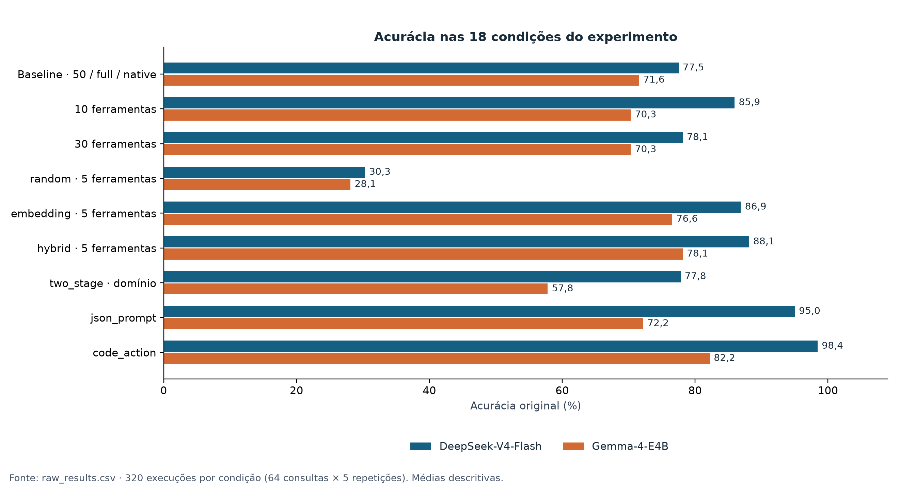
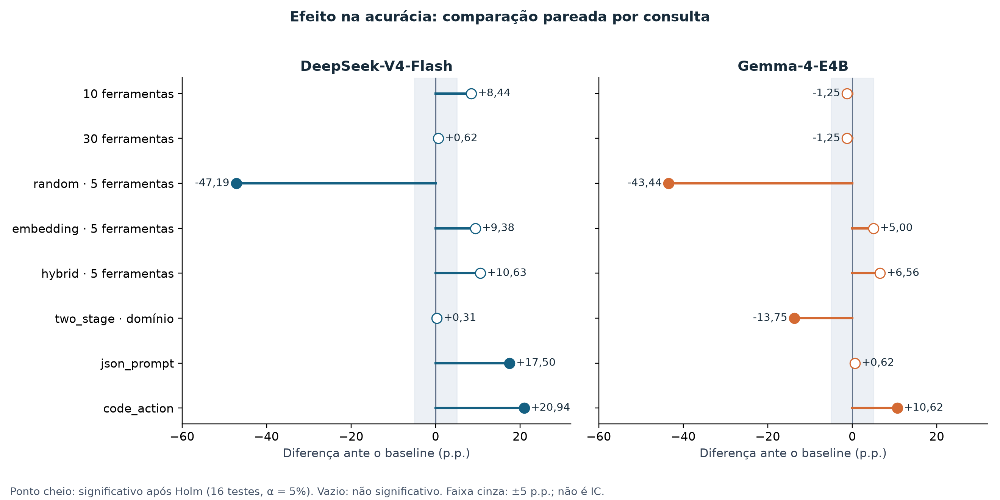
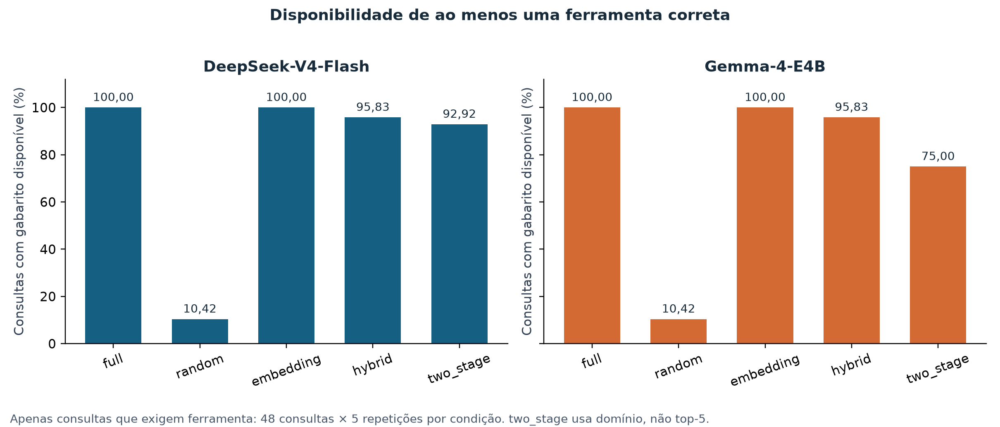
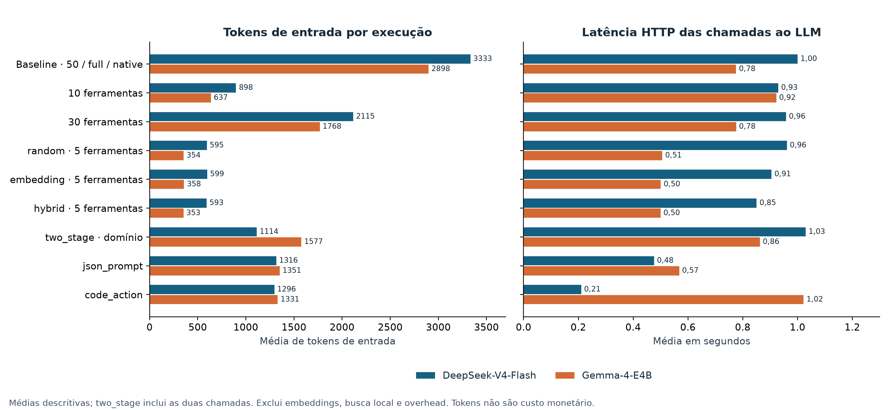
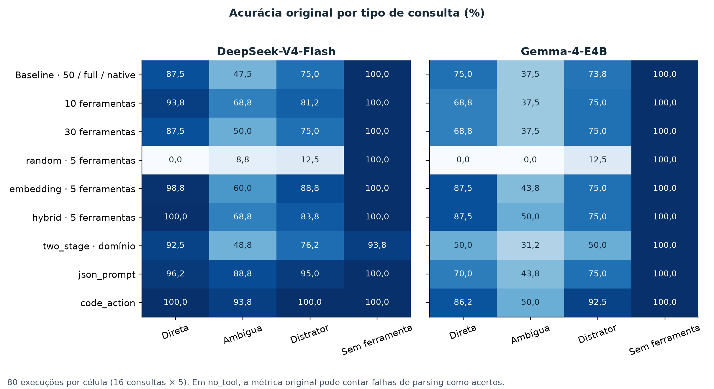
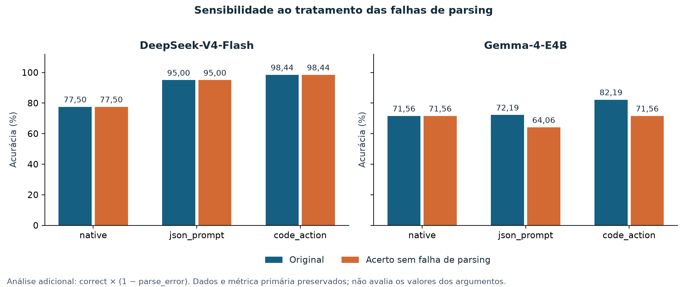

# TCC-USP-ESALQ

**A forma de expor ferramentas condiciona acurácia, alucinação e custo em agentes LLM**

Benchmark controlado sobre três eixos de exposição de ferramentas, com dois LLMs
servidos localmente. Este README apresenta os resultados, sua interpretação e as
instruções de reprodução. O [escopo do TCC](ESCOPO.md) detalha a pergunta de pesquisa
e os objetivos; o [apoio à redação](docs/APOIO_DISSERTACAO.md) reúne texto-base,
legendas e pontos a discutir com o orientador.

**Versão do instrumento:** os gráficos abaixo descrevem a coleta histórica.
O executor atual usa o **protocolo 2**, com correções de parsing, identificação de
origem e saídas separadas. Nenhuma resposta histórica foi reinterpretada ou
substituída. Consulte o [registro da revisão e da reprodução](docs/REVISAO_TECNICA.md).

## Resultados: síntese da base de 7 de setembro de 2026

A base analisada contém **5.760 execuções válidas: 18 condições × 64 consultas ×
5 repetições**, sem lacunas ou duplicatas válidas. São 320 execuções por condição,
mas **64 unidades pareadas** nos testes estatísticos. As condições originais foram
executadas em 30/08/2026; o braço `random`, em 07/09/2026, conforme os timestamps do CSV.

**O principal achado depende do modelo e da definição de acerto.** No DeepSeek,
`code_action` elevou a acurácia de 77,50% para 98,44%, com evidência estatística após
Holm-Bonferroni. No Gemma, o ganho da métrica original desaparece quando também se
exige ausência de falha de parsing. A recuperação por `embedding` e `hybrid` reduziu
os tokens de entrada e superou a seleção aleatória, mas não demonstrou ganho de
acurácia sobre `full` após a correção das múltiplas comparações.

As figuras e tabelas abaixo foram recalculadas a partir de
[`results/raw_results.csv`](results/raw_results.csv), sem executar novas inferências
ou modificar a métrica original. Os derivados desta apresentação ficam em
[`docs/data/`](docs/data/); o [registro de auditoria](docs/data/audit.json) informa o
SHA-256 da base, a cobertura do plano e as versões usadas. Os CSVs preexistentes em
`results/` foram preservados e podem corresponder a outra versão da análise.

### 1. Acurácia por condição



**Figura 1.** Média de `correct` em cada condição. As barras são descritivas;
diferenças visuais não substituem os testes pareados. Salvo o fator indicado,
mantém-se o baseline `50 / full / native`.

| Condição | DeepSeek: acurácia | Gemma: acurácia |
|---|---:|---:|
| Baseline: 50 / full / native | 77,50% | 71,56% |
| 10 ferramentas | 85,94% | 70,31% |
| 30 ferramentas | 78,12% | 70,31% |
| random | 30,31% | 28,12% |
| embedding | 86,88% | 76,56% |
| hybrid | 88,12% | 78,12% |
| two_stage | 77,81% | 57,81% |
| json_prompt | 95,00% | 72,19% |
| code_action | 98,44% | 82,19% |

Fonte: [resumo das 18 condições](docs/data/summary_by_condition.csv). Os percentuais
da tabela refletem as médias arredondadas pelo analisador existente.

### 2. Quais diferenças têm sustentação estatística?



**Figura 2.** Diferença em pontos percentuais (p.p.) entre cada variante e o baseline
do mesmo modelo. Pontos cheios indicam significância após Holm; a faixa de ±5 p.p.
indica o limiar de relevância prática, **não um intervalo de confiança**.

| Variante versus baseline | DeepSeek: Δ p.p. | p ajustado | Gemma: Δ p.p. | p ajustado |
|---|---:|---:|---:|---:|
| 10 ferramentas | +8,44 | 0,1230 | −1,25 | 1,0000 |
| 30 ferramentas | +0,62 | 1,0000 | −1,25 | 1,0000 |
| random | −47,19 | 0,0016 | −43,44 | 0,0016 |
| embedding | +9,38 | 0,1230 | +5,00 | 0,7787 |
| hybrid | +10,63 | 0,1230 | +6,56 | 0,4249 |
| two_stage | +0,31 | 1,0000 | −13,75 | 0,0451 |
| json_prompt | +17,50 | 0,0039 | +0,62 | 1,0000 |
| code_action | +20,94 | 0,0016 | +10,62 | 0,0228 |

Fonte: [testes pareados completos](docs/data/ofat_tests_correct.csv). Significância:
`p ajustado ≤ 0,05`; relevância prática: `|Δ| ≥ 5 p.p.`. Um efeito negativo
significativo representa **piora**, mesmo quando sua magnitude é relevante.

As cinco repetições são agregadas por consulta antes do teste bilateral de
permutação por troca de sinal, com 10.000 permutações e semente 20260830.
Holm-Bonferroni é aplicado à família de **16 comparações**: oito variantes por modelo.
As decisões usam valores não arredondados; os arquivos guardam `p` bruto e `p_holm`.
O cálculo reutiliza as funções de [analyze.py](analyze.py), reiniciando a semente no
início de cada família. Pequenas diferenças frente a outros relatórios podem
decorrer da ordem de consumo do gerador aleatório e da inclusão do braço `random`.

No DeepSeek, os ganhos de `json_prompt` e `code_action` passam pelos dois critérios.
No Gemma, `code_action` melhora a métrica original e `two_stage` a reduz. O resultado
de `two_stage` está próximo ao limiar de significância e merece cautela na redação.
Os ganhos observados com `embedding` e `hybrid` sobre o baseline não são
estatisticamente conclusivos nesta família. Isso **não demonstra equivalência**.

### 3. Recuperação relevante versus seleção aleatória



**Figura 3.** Proporção de execuções com ao menos uma ferramenta do gabarito entre
as ferramentas expostas. O denominador exclui `no_tool`: são 48 consultas × 5
repetições por condição. Para consultas com várias ferramentas aceitáveis, a medida
é um indicador de sucesso de recuperação, não a fração de todos os itens relevantes.

`embedding` preservou ao menos uma ferramenta correta em **100%** dessas execuções;
`hybrid`, em **95,83%**; `random`, em **10,42%**, nos dois modelos. Em `two_stage`,
a disponibilidade foi de **92,92%** no DeepSeek e **75,00%** no Gemma. Nesse modo, o
LLM escolhe um domínio e expõe suas ferramentas, com fallback para o conjunto todo;
o código atual **não aplica top-5 nem embeddings na segunda etapa**.

Em análise exploratória adicional, mantendo cinco ferramentas expostas e invocação
nativa, `embedding` superou `random` em **56,56 p.p.** no DeepSeek e **48,44 p.p.** no
Gemma; `hybrid` superou `random` em **57,81 e 50,00 p.p.**, respectivamente. Os quatro
contrastes têm `p ajustado ≈ 0,0004`, com Holm aplicado a uma família separada.
Fonte: [contrastes exploratórios](docs/data/exploratory_vs_random.csv) e
[disponibilidade do gabarito](docs/data/retrieval_with_tool.csv).

Isso sustenta a importância da seleção relevante frente ao controle aleatório
observado. Não autoriza atribuir todo o ganho a uma única causa: composição do
conjunto, presença do gabarito e datas de execução também diferem. O sorteio fixo
por consulta não mede a variabilidade entre diferentes sementes de `random`.

### 4. Tokens de entrada e latência



**Figura 4.** Médias por execução. No `two_stage`, somam-se os tokens de entrada e
as latências das duas chamadas ao LLM. Os tokens são os informados por cada servidor;
comparações de eficiência devem privilegiar variantes dentro do mesmo modelo.

Com `embedding`, a média de tokens de entrada caiu de **3.333,28 para 598,59** no
DeepSeek (**−82,04%**) e de **2.898,20 para 358,23** no Gemma (**−87,64%**).
Com `hybrid`, as reduções foram de **82,22% e 87,83%**, respectivamente.

`code_action` teve latência média de **0,2105 s** no DeepSeek, ante **1,0003 s** no
baseline. No Gemma, a direção foi oposta: **1,0223 s**, ante **0,7756 s**.
Portanto, menos tokens de entrada não implicaram menor latência em todas as condições.

Essas são comparações **descritivas**, sem teste inferencial de custo neste relatório.
A latência medida em [client.py](client.py) é o tempo HTTP das chamadas de chat,
incluindo rede e eventuais retentativas. Ela exclui geração de embeddings, busca
local e outras etapas do pipeline. Não mede diretamente tempo de GPU, energia ou
custo monetário. As condições foram executadas em blocos; carga do servidor e
efeitos de ordem não estão controlados por estas médias.

### 5. Tipos de consulta e alucinação



**Figura 5.** Acurácia original por tipo: 16 consultas e 80 execuções por célula.
Fonte: [tabela por tipo de consulta](docs/data/accuracy_by_query_type.csv).

As consultas ambíguas concentraram as menores acurácias no baseline: **47,50%** no
DeepSeek e **37,50%** no Gemma. No DeepSeek, `code_action` alcançou **93,75%** nesse
grupo. Essa decomposição é descritiva; não foram feitos testes adicionais por tipo.

Foram observadas **cinco ocorrências de `hallucinated`**, todas no DeepSeek com
`two_stage`: **5/320 = 1,56%** da condição, ou **5/80 = 6,25%** de suas execuções
`no_tool`. Não houve nomes de ferramentas inventados registrados na base. A métrica
é específica: uma escolha errada de ferramenta existente pode ser erro de acurácia
sem ser alucinação. Os poucos eventos e as falhas de parsing impedem uma conclusão
ampla de que uma técnica elimina alucinações.

### 6. Sensibilidade: acerto também exige resposta interpretável?



**Figura 6.** Análise adicional que usa `correct × (1 − parse_error)`. A métrica
primária e os registros originais continuam intactos.

Em [invocation.py](invocation.py), uma falha de parsing pode retornar ausência de
ferramenta. Em [run_experiment.py](run_experiment.py), essa ausência conta como acerto
quando o gabarito é `no_tool`. Assim, **60 das 117 falhas de parsing** aparecem também
como acertos: 34 no Gemma com `code_action` e 26 com `json_prompt`.

| Modelo e invocação | Acurácia original | Acerto sem falha de parsing | Falhas de parsing |
|---|---:|---:|---:|
| DeepSeek / native | 77,50% | 77,50% | 0/320 |
| DeepSeek / json_prompt | 95,00% | 95,00% | 0/320 |
| DeepSeek / code_action | 98,44% | 98,44% | 0/320 |
| Gemma / native | 71,56% | 71,56% | 0/320 |
| Gemma / json_prompt | 72,19% | 64,06% | 57/320 (17,81%) |
| Gemma / code_action | 82,19% | 71,56% | 60/320 (18,75%) |

Fonte: [resumo de sensibilidade](docs/data/sensitivity_summary.csv). No Gemma,
`code_action` passa a ter **Δ = 0,00 p.p.** ante o baseline, com `p ajustado = 1,0000`.
`json_prompt` passa a **−7,50 p.p.**, sem significância após Holm (`p ajustado = 0,9085`).
Os ganhos do DeepSeek permanecem. A sensibilidade repete as 16 comparações em uma
família separada: [testes de sensibilidade](docs/data/sensitivity_tests.csv).

Essa análise testa uma exigência operacional adicional; não substitui retrospectivamente
a métrica principal. Também não verifica os valores dos argumentos nem executa as
ferramentas. Na versão usada na coleta histórica, o parser `native` retornava
`parse_error=False` por construção. O protocolo 2 valida a estrutura da chamada;
isso não altera o zero registrado anteriormente nem certifica os argumentos.

## Como usar os resultados na dissertação

A conclusão sustentada é que **a configuração de exposição e invocação afeta o
desempenho neste benchmark, com efeitos dependentes do modelo e da métrica**.
No DeepSeek, há evidência de ganho com invocação textual estruturada; no Gemma, a
interpretação precisa incluir as falhas de parsing. A recuperação relevante oferece
redução expressiva de tokens e desempenho superior ao controle aleatório, mas não
há evidência suficiente de aumento de acurácia ante `full` após Holm.

Não se demonstrou que `code_action` é universalmente superior, que recuperação e
`full` são equivalentes, nem que combinar as melhores variantes produziria ganhos
aditivos. A superioridade direta de `code_action` sobre `hybrid` não foi testada.
O desenho OFAT não estima interações entre tamanho, recuperação e invocação.

O [texto de apoio à dissertação](docs/APOIO_DISSERTACAO.md) traz parágrafos adaptáveis
para Resultados, Discussão e Conclusão. Todas as figuras estão disponíveis em
[PNG de alta resolução e PDF vetorial](docs/figures/), com dados em [CSV](docs/data/).

## Reprodução das figuras e tabelas

Com o `.env` configurado e as dependências do projeto disponíveis, instale
`matplotlib` no ambiente usado apenas para gerar a documentação:

```bash
py -m pip install -r requirements-figures.txt
py docs/generate_results.py
```

O script faz somente análise local: valida a cobertura das 18 condições, reutiliza
o teste estatístico existente e grava figuras/tabelas em `docs/`. Não chama os
servidores, não executa o experimento e não sobrescreve `results/`. Ao trocar a base,
regenere as figuras e revise também os números e as conclusões escritos neste README
e no texto de apoio; a redação não é atualizada automaticamente.

## Decisões de escopo (30/08/2026, com random incluído em 07/09/2026)

| Questão | Decisão |
|---|---|
| Modelos | **Os dois entram como dimensão comparativa**: DeepSeek-V4-Flash-0731 e gemma-4-E4B-it |
| Corpus | **Sintético** — 52 ferramentas, 4 domínios, 8 pares confusáveis. Sem questão de confidencialidade; validade externa é limitação declarada |
| Eixos | **Os 3 completos**, incluindo `code_action` |
| Queries | **64**, balanceadas 16 por tipo |
| Repetições | 5 |
| Significância | Holm-Bonferroni a 5%, teste de permutação pareada |
| Efeito mínimo relevante | 5 pontos percentuais de acurácia |

## Infraestrutura

Endpoints OpenAI-compatíveis registrados em [config.py](config.py):

| Serviço | Porta | Model id |
|---|---|---|
| LLM A | `8000` | `DeepSeek-V4-Flash-0731` |
| LLM B | `8001` | `/srv/models/gemma-4-E4B-it` |
| Embeddings | `8002` | `/srv/models/qwen3-embedding-8B` (4096 dim) |

O host fica em `TCC_SERVER_HOST`, no `.env` (fora do git — este repositório é
público). Copie `.env.example` para `.env` antes de rodar:

```bash
cp .env.example .env    # e preencha o endereço do servidor
```

`config.py` lê o `.env` e **falha na hora** se a variável não existir, em vez de cair
num default silencioso.

> Os dois LLMs suportam *native tool calling* (campo `tools` + `tool_calls`), o que
> viabiliza o eixo 3 sem gambiarra.

O plano atual tem **5.760 execuções e 6.400 chamadas de chat previstas**, incluindo
640 chamadas adicionais do `two_stage`, sem contar embeddings e retentativas.
Os servidores são locais. Tokens e latência são indicadores operacionais; o
experimento não mede o custo financeiro da infraestrutura.

## Desenho experimental (OFAT)

Baseline: `toolset=50, retrieval=full, invocation=native`. Cada eixo varia sozinho
a partir dele, então toda comparação difere do baseline em exatamente um fator.

- **Eixo 1 — exposição:** toolset de 10 / 30 / 50 ferramentas
- **Eixo 2 — recuperação:** `full` / `random` / `embedding` / `hybrid` (RRF) / `two_stage`; k=5 em `random`, `embedding` e `hybrid`
- **Eixo 3 — invocação:** `native` / `json_prompt` / `code_action`

18 condições (9 por modelo; o baseline roda uma vez e é comparado nos três eixos).

### Três decisões de desenho

**1. O toolset é montado por query.** O gabarito da query (mais o `lure` e o par
confusável correspondente) está sempre presente, em qualquer tamanho; o resto é
preenchido com distratores. Sem isso, num toolset de 10 sorteado de um pool de 52
a ferramenta correta quase nunca estaria lá, e o eixo de exposição mediria
*ausência*, não efeito do tamanho. Os toolsets são aninhados (10 ⊂ 30 ⊂ 50) e
determinísticos por query, então a comparação é pareada de verdade.

**2. `random` é controle aleatório.** Expõe cinco ferramentas sorteadas e permite
comparar estratégias com o mesmo número de ferramentas. O sorteio é semeado por
consulta e é idêntico entre repetições e modelos. A presença de alguma ferramenta
correta foi de 10,42% nas consultas que exigem ferramenta. Esse controle não isola
sozinho um efeito puro de tamanho, pois também pode remover o gabarito. O valor
5/50 é a probabilidade de inclusão de uma ferramenta específica; consultas com
várias respostas aceitáveis têm probabilidade distinta de ao menos um acerto.

**3. A unidade de análise é a query, não a chamada.** As 5 repetições viram a média
por query antes do teste. Tratar repetições da mesma query como observações
independentes infla o N e o poder estatístico artificialmente.

## Dataset de queries

64 queries em pt-BR, 16 por tipo:

- `direct` — uma ferramenta claramente correta
- `ambiguous` — cabe em mais de uma ferramenta de um par confusável; acertar qualquer uma conta
- `distractor` — a correta existe, mas o texto evoca lexicalmente outra (o `lure`)
- `no_tool` — nenhuma ferramenta se aplica; chamar qualquer uma é alucinação

## Métricas

| Métrica | Definição |
|---|---|
| `correct` | ferramenta prevista ∈ gabarito (ou nenhuma chamada, em `no_tool`) |
| `hallucinated` | chamou ferramenta quando não devia, **ou** chamou nome fora do toolset exposto |
| `invented_tool` | nome previsto não existe no toolset exposto |
| `lure_hit` | caiu exatamente no distrator lexical |
| `parse_error` | resposta não pôde ser lida no formato pedido |
| `retrieval_hit` | o gabarito sobreviveu à etapa de recuperação — separa erro de retrieval de erro do modelo |
| custo | `prompt_tokens` e latência, somando a 1ª etapa do `two_stage` |

Em `no_tool`, `retrieval_hit` recebe 1 por convenção. Por isso, a média geral
`recall_retrieval` de `random` é 32,81%, enquanto a disponibilidade nas consultas
com ferramenta é 10,42%. A Figura 3 usa esta última medida para evitar misturar
casos em que não há ferramenta a recuperar.

## Como rodar

Para preparar o ambiente local (Python 3.14.0), instale as versões registradas:

```bash
py -m pip install -r requirements.txt
```

Configure o `.env` conforme a seção Infraestrutura. As novas coletas são separadas
por backend e protocolo. O padrão continua sendo `mock`, com saída segura própria.

```bash
py run_experiment.py --plan-only                  # plano + estimativa, não chama nada
py run_experiment.py --backend mock              # results/mock_results_v2.csv
py run_experiment.py --backend real --repetitions 1 --limit 12 --out results/pilot_v2.csv
py run_experiment.py --backend real              # results/real_results_v2.csv
py analyze.py                                   # análise original da coleta histórica
py analyze.py --input results/real_results_v2.csv
py analyze.py --input results/real_results_v2.csv --metric correct_valid_parse
py -m unittest discover -s tests -v              # regressões locais, sem chamadas aos modelos
```

Cada novo CSV recebe um manifesto `<arquivo>.csv.meta.json`, com backend, protocolo,
versões locais e hashes do código. A retomada exige origem e ambiente compatíveis;
arquivos legados, inclusive `raw_results.csv`, não recebem novas linhas. Se mudar
código ou ambiente, escolha outro `--out`. O nome de uma execução (`run_id`) é único
dentro desse arquivo e da origem registrada, não globalmente entre backends.

`correct` conserva a definição histórica; `correct_valid_parse` exige também
ausência de erro de parsing. A segunda análise escreve arquivos com sufixo próprio.
Use `--output-dir <pasta>` para guardar derivados em outra pasta. O analisador
rejeita duplicatas válidas, métricas inválidas e contrastes sem pareamento de
consultas ou repetições. Tentativas com erro de execução são informadas e excluídas.

Cada módulo tem autoteste embutido: `py corpus.py`, `py queries.py`, `py client.py`,
`py invocation.py`, `py retrieval.py`.

### Docker (Python 3.14)

```bash
docker compose build
docker compose run --rm tcc            # abre o bash dentro do container, em /app
```

Dentro do container os comandos são os mesmos, com `python` no lugar de `py`:

```bash
python corpus.py                       # autotestes
python run_experiment.py --plan-only
python run_experiment.py --backend real
python analyze.py --input results/real_results_v2.csv
```

O projeto inteiro é volume (`.:/app`): editar no host reflete na hora, e `results/`
fica no host — o dado primário não morre junto com o container.

> **Um executor por arquivo.** Host e container compartilham `results/`.
> A retomada evita repetir execuções válidas, mas não implementa bloqueio para
> gravação concorrente. Use `--out` separado para processos simultâneos.

O runner grava linha a linha com `flush` e retoma pelo `run_id`: queda, timeout ou
rate limit não perdem o lote nem duplicam trabalho. Linhas com erro são regravadas
na próxima execução.

> **Cache de embeddings é separado por backend.** Rodar `mock` e depois `real`
> compartilhando o mesmo arquivo envenena o índice com vetores falsos e a recuperação
> passa a errar em silêncio — foi o que aconteceu no primeiro piloto (recall@5 caiu
> para 0,12). `EmbeddingIndex` agora estoura se as dimensões se misturarem.

## Dados

`results/raw_results.csv` é o **dado primário do TCC** e é versionado no git. Não
é sobrescrito nem ampliado pelo protocolo 2. Os resultados e gráficos históricos
continuam associados à versão que os produziu; não devem ser misturados às novas coletas.

## Limitações declaradas

- Corpus sintético: validade externa limitada frente a APIs reais de produção.
- `k=5` fixo no retrieval; variar `k` seria uma quarta dimensão, fica para trabalhos futuros.
- Busca léxica do `hybrid` é sobreposição de tokens, não BM25.
- Eixos testados isoladamente (OFAT): não há estimativa de interação entre eles. O
  efeito de `embedding` é conhecido em toolset=50, e o efeito do tamanho apenas sob
  `full` — a leitura "X piora conforme o toolset cresce" não é sustentada pelo desenho.
- Dois modelos entram como dimensão comparativa, ambos servidos localmente:
  os achados não se estendem automaticamente a outros modelos.
- Um único avaliador no gabarito das queries (campo `reviewed_by` está pendente) —
  segunda revisão independente aumentaria a credibilidade do instrumento.
- A acurácia original aceita ausência de chamada mesmo após falha de parsing em
  `no_tool`; a sensibilidade apresentada mostra o impacto dessa definição.
- O braço `random` foi executado em outra data e usa um único sorteio por consulta.
- A invocação altera simultaneamente o formato de exposição, as instruções e o
  parser. O desenho não identifica separadamente qual componente explica o efeito.
- O CSV histórico não registra o backend, a revisão exata dos pesos nem a resposta bruta do
  servidor. A identidade dos modelos vem da configuração do projeto; a proveniência
  de cada execução deve ser corroborada pelos registros de execução disponíveis.
- As repetições usam temperatura 0 e as mesmas consultas. Não substituem novas
  consultas, novos domínios ou replicações independentes.
- Tokens e latência não incluem toda a recuperação nem medem custo monetário;
  não foram estimados intervalos de confiança ou testes de equivalência neste relatório.

## Organização do projeto

```text
TCC-USP-ESALQ/
├── README.md                  # resultados, figuras e reprodução
├── ESCOPO.md                  # pergunta de pesquisa e escopo
├── config.py                  # configuração e leitura do ambiente
├── corpus.py / queries.py     # ferramentas e consultas
├── client.py                  # acesso aos modelos e backend mock
├── invocation.py / retrieval.py
├── run_experiment.py          # execução do experimento
├── analyze.py                 # análise original
├── compose.yaml
├── requirements.txt           # versões do ambiente de execução e análise
├── requirements-figures.txt   # dependência adicional das figuras
├── docker/Dockerfile
├── tests/test_integrity.py    # regressões de parsing, integridade e retomada
├── results/                   # dados primários e derivados preexistentes
└── docs/
    ├── APOIO_DISSERTACAO.md    # texto-base e orientações de redação
    ├── REVISAO_TECNICA.md     # versão do instrumento e limites da reprodução
    ├── generate_results.py    # geração local das figuras e tabelas
    ├── data/                  # tabelas desta apresentação e auditoria
    └── figures/               # seis figuras em PNG e PDF
```
